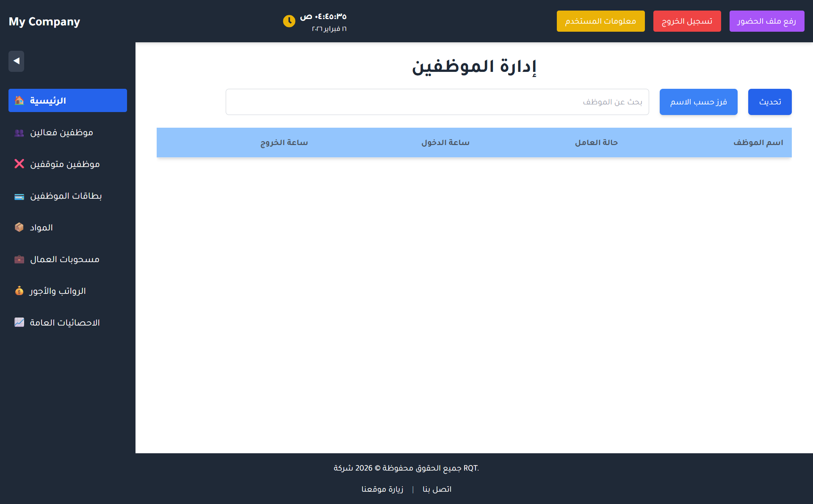

# EmpMonitor — Employee Attendance & Payroll Management System

## Project Overview

**EmpMonitor** is an integrated software platform designed to support workforce monitoring, attendance tracking, and payroll management within organizational settings. The system provides a centralized solution for administrators to oversee employee presence, contractual obligations, and compensation calculations through a single interface.

---

## Important Notice

This project was originally developed for a **specific company** as a tailored solution to address its internal operational needs. As such, it is **not presented as a fully completed or production-ready product** across all functional dimensions. The project has been included in this portfolio **for demonstrative purposes only**, to illustrate capabilities in building enterprise-oriented management systems and to showcase the implementation of core concepts in attendance monitoring and payroll processing.

---

## Objectives & Core Ideas

### Primary Objectives

1. **Attendance Monitoring**
   - Track employee check-in and check-out times in a structured, searchable format.
   - Provide visibility into daily presence and working hours for administrative decision-making.

2. **Contract Management**
   - Associate each employee with a defined contractual period (start and end dates).
   - Distinguish between active and inactive employees based on contract validity.

3. **Payroll Simplification**
   - Automate salary calculations based on recorded attendance and predefined hourly rates.
   - Integrate deductions from employee withdrawals (e.g., advances, material usage) into the final compensation figure.

4. **Material & Withdrawal Tracking**
   - Maintain a record of materials or advances allocated to employees.
   - Link such transactions to payroll so that appropriate deductions are applied during salary computation.

---

## System Philosophy

The system operates on the principle of **centralized data flow**:

- Employee data forms the foundation; each worker is identified by unique attributes (e.g., fingerprint identifier used with biometric devices).
- Attendance data is collected externally (e.g., from ZKTeco devices) and imported into the system to be matched with employee records.
- Withdrawals and material assignments are recorded and associated with specific employees.
- Payroll is derived automatically from attendance, hourly rates, and deductions, reducing manual calculation errors and administrative overhead.

---

## Main Pages & Functionality

### 1. Main Dashboard (Employee Management)

The main dashboard serves as the **primary administrative hub**. It displays:

- A searchable list of employees who have recorded attendance for the current day.
- Employee name, worker status (active, expiring, or expired contract), entry time, and exit time.
- Quick access to refresh data, sort by name, and search for specific employees.
- Integration with the attendance upload feature for importing biometric device data.

**Main Dashboard Interface** — The central view combines employee management with attendance overview, providing immediate visibility into who is present and their contractual status.

---

### 2. Active Employees

This section lists all employees whose contracts are currently valid and active. Administrators can view attendance history, contract details, and perform standard management operations on active personnel.

---

### 3. Inactive Employees

Employees whose contracts have ended or been terminated are listed here. This separation allows the organization to maintain clear records of current versus former workers while retaining historical data.

---

### 4. Employee Cards

A dedicated view for employee identification cards or profiles. This page supports quick reference to employee information in a card-based layout, useful for verification and record-keeping.

---

### 5. Materials

This module manages the inventory of materials or items that may be allocated to employees. Materials are associated with a name, price, and quantity, enabling the system to calculate the cost of withdrawals that will be deducted from salaries.

---

### 6. Worker Withdrawals

Here, administrators record withdrawals made by employees—whether advances, material allocations, or other deductions. Each withdrawal is linked to an employee and a material (or equivalent), with quantity and cost tracked for payroll integration.

---

### 7. Salaries and Wages

This page provides an overview of calculated salaries for employees. It displays:

- Total worked hours.
- Gross salary (based on hours and hourly rate).
- Total withdrawals (deductions).
- Final salary (net amount).
- Payment status and remaining balance for partial or installment payments.

Administrators can register payments, update settlement status, and monitor which salaries have been fully paid.

---

### 8. General Statistics

A reporting section that offers aggregate insights into the workforce, attendance patterns, and payroll metrics. This supports higher-level analysis and planning.

---

## How the System Works (Conceptual Flow)

1. **Setup**: Employees are registered with their personal data, contract dates, hourly rate, and a fingerprint identifier that corresponds to the biometric device.

2. **Attendance Import**: Attendance records from ZKTeco devices (typically in XML format) are uploaded through the system. The platform matches each record to the corresponding employee and stores check-in and check-out times.

3. **Withdrawals**: When an employee receives an advance or withdraws materials, the transaction is recorded and linked to that employee and the relevant material or item.

4. **Salary Calculation**: The system computes each employee’s salary by:
   - Summing worked hours from attendance pairs (check-in → check-out).
   - Multiplying total hours by the hourly rate to obtain gross salary.
   - Subtracting the total cost of withdrawals.
   - Producing a net salary figure, with support for partial payments and settlement tracking.

5. **Administrative Actions**: Users can search, filter, update records, register payments, and view statistics through the various pages described above.

---

## Conclusion

EmpMonitor demonstrates a cohesive approach to integrating attendance, contract, material, and payroll management into a single platform. While the project was developed for a specific organizational context and is presented here as a portfolio piece rather than a fully complete product, it illustrates the design and implementation of key workflows essential to workforce and payroll administration in enterprise environments.

---

*© 2026 — Project documentation for portfolio purposes.*
